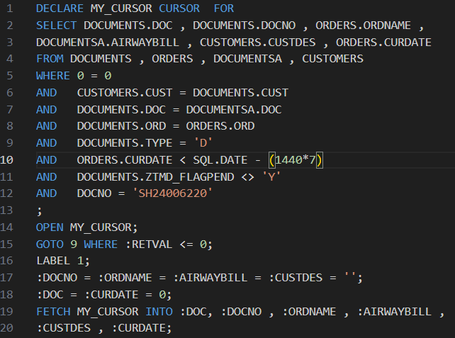
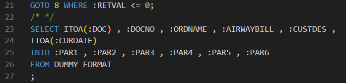

# PriMailer
 Priority HTML emails

# Priority sending emails plan:

***First thing to do is to come up with types of HTML template messages***
In our case there are 3 types for 3 statuses of online orders places by customer: 
- `Pending Approval`
- `Confirmed`
- `Shipped`

***In order to create HTML template we are going to need few things which each of templates consists of:***
- Static data(text) which most likely is the same from template to template.
- Dynamic data(name/order number/order date) which we SELECT from client's Database.
- Static images such as company logo which stays the same on each of templates.
- Dynamic images such as order statuses.

***Create procedure for storing our HTML templates created earlier***

***Create another procedure responsible for and write a SQL statement***, which would:
   - SELECT all required data and put it into declared above variables.
   - Those variables would be passed into relevant variables of our HTML template .
   - Send each HTML template based on business logic to customer's emails.

## Step_1: Uploading images
1. Find all the images needed and upload them to the virtual folder on the client's IIS server.
`Open IIS manager --> Sites --> Default Web Sits --> find or create folder for storing images --> primail --> images`

   

2. Create a link for each image you stored by simply copying WEB path of each of them.

   

3. Save all the links for each image somewhere as you will need them further to pass into HTML templates 
in our case there are <P2> and <P5> corresponding to order number and customer name.

    

## Step_2: Creating HTML templates

1. Build your HTML templates in regards to client's requirement.
In our case there are 3 templates for different online order statuses
such as `"Pending Approval", "Confirmed", "Shipped"`

2. Define what data would be dynamic (taken from client's database) and highlight it as we will need to 
swap this data for parameters(variables) to which we assign SELECTed fields from client's DB.

   

## Step_3: Creating Procedure for holding HTMLS

1. ***So, go to procedure generator***, and create procedure which only purpose will be to store our HTMLs
in our case it's called `ZTMD_EMAILS` with `Templates` description.

   

2. ***Go to sublevel*** form `Procedure Steps` and create a `SQLI` entity.

   

3. ***Go to sub form*** `Step Query` and create just 1 line with comments tags `/* */`
The reason we are doing that is to get to the `Procedure messages` which is the sub form 
to `SQLI` entity only! But because we don't need any SQL statement here, we leave it as a comment string as
we still need to put something in this form to get to the `Procedure messages`.

   

4. ***Go to sub form*** `Procedure Messages`. Here we are going to load our HTML templates.
Create records and name them correspondingly with our HTML templates names.
Very important is to leave the first line !!! EMPTY !!! because:
`The blank step is required to tell the sendmail command that it's using the temp file as the body, rather than as an 
attachment` otherwise our templates will not be shown as actual email format page, it would be considered as 
attachment(pdf, docx).

   
       
5. ***Go to sub form*** `Procedure Messages(content)` for each of HTML and insert our HTMLs accordingly.
   - Make sure your HTML tags and it's contents are all aligned by left side before you paste it, 
   there should be no white spaces or new line symbols.
   - To do that go to where your HTML was written(VScode in our case) `--> open HTML template --> press "ctrl + H"`
   and make 3 steps to remove spare symbols:
     - replace all `\n[ ]+` with ` `
     - replace all `<` with `\n<`
     - replace all `\n\n` with `\n`

    
## Step_4: Creating Procedure for Sending Emails
#### Getting values we are going to include in our HTML templates:

1. ***Go to procedure generator***, and create procedure which will select all dynamic data from DB and send it to customer
(`ZTMD_MAILTEST` in our case).

        
2. ***Go to sub form*** `Procedure Steps` and create a SQLI entity.

        
3. ***Go to sub form*** `Step Query` pres `F6` and open code editor.
Okay, Lets split this code into a few sections for easier understanding:

   1. **SELECT statement.**
   Just selecting fields that we spoke about earlier as of dynamic data.
   
      
        
   2. **Declaring Cursor** and fetching selected fields into the so-called variables.
   
      

   3. **Selecting** these variables into `Parameters` used as a reserved variables in procedures.
   At this point we could have fetched our cursor straight into :PAR variables at the first place.
   
      

 - ### Step_4.1: Email-Sending steps:

 1. ***Declaring*** few self-explanatory variables such as `:_REPLYTOEMAIL`, `:_Subject`, `:sendto`.

    
        
 2. ***Choosing*** HTML template by MSG number we defined earlier (`Step_3: Creating Procedure for holding HTMLS[4]`)
    - As we defined  MSG number against each of our HTML we just take this number and assign it to a `:ENTMSG` variable,
    also we assign `:ENT = 'ZTMD_EMAILS'` name of procedure to entity variable and 
    `:ENTTYPE = 'P'` as Procedure type for our `ZTMD_EMAILS` procedure.
    
    

 3. ***Creating*** temporary file`.html` and assign it to `:TMPFILE` 
    (`SELECT STRCAT(SQL.TMPFILE , '.html') INTO :TMPFILE FROM DUMMY`)
    - `#INCLUDE MAILBOX/ZTMD_BUF1` this line is reading our `:TMPFILE.html`
    looking for every parameter(`
`) in it.
    
    
    - `MAILMSG 20 TO EMAIL :sendto DATA :TMPFILE` in this line we actually tell what email we are sending
    HTML to `TO EMAIL :sendto` and what would be in it `DATA :TMPFILE`, note that `MAILMSG 20` is a required blank step 
    which tells our procedure to send HTML as a body rather then an attachment file. 
 4. Looping back to LABEL 1, closing labels 8 and 9 and closing our cursor.

    
 
    